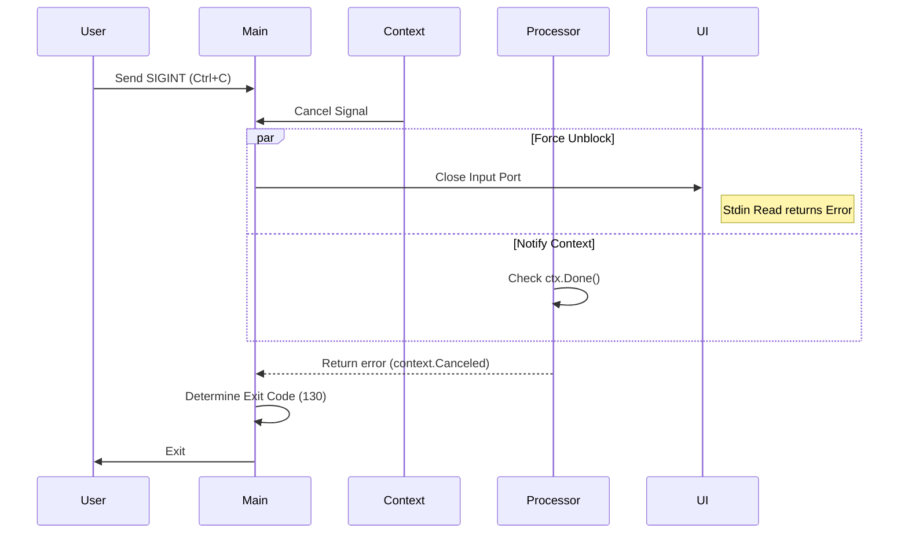

# Code Packer (codepack) 設計仕様書

| 項目 | 内容 |
| --- | --- |
| **Project Name** | Code Packer (codepack) |
| **Version** | v1.2.0 |
| **Status** | Approved for Implementation |
| **Role** | Lead Architect |

---

## 1. プロジェクト概要

### 1.1 目的

大規模なソースコードベースを、LLM（Large Language Models）へのコンテキスト提供に最適化された「単一のMarkdownファイル」へ変換する。手作業によるコピー＆ペーストの手間を排除し、不要ファイルの除外やトークン節約を自動化することを目的とする。

### 1.2 アーキテクチャ方針

* **Clean Architecture:** UI、CLI設定、コアロジックの責務を明確に分離し、テスト容易性と保守性を確保する。
* **Streaming First:** 大規模プロジェクトの処理を想定し、全データのオンメモリ保持を禁止する。`io.Reader/Writer` を活用したパイプライン処理を徹底する。
* **Robust Concurrency:** `context` による完全なキャンセル制御（Graceful Shutdown）と、ゴルーチンリークのない設計を実装する。

---

## 2. 機能要件 (Functional Requirements)

### 2.1 ユーザーインターフェース (CLI)

標準ライブラリ `flag` パッケージを使用し、以下のコマンドライン引数をサポートする。

#### フラグ仕様

| フラグ | 型 | デフォルト | 説明 |
| --- | --- | --- | --- |
| `-d` | string | `.` | スキャン対象のルートディレクトリパス |
| `-o` | string | `codebase.md` | 出力ファイル名 |
| `-c` | bool | `false` | クリップボードへコピー（ファイル出力の代わり、または併用） |
| `-i` | strings | `[]` | **[追加]** 追加のignoreファイルパス（複数回指定可） |
| `-p` | strings | `[]` | **[追加]** 追加の除外パターン文字列（複数回指定可、例: `-p "*.log"`） |
| `-m` | string | `""` | **[追加]** 言語マップJSONファイルのパス（デフォルト設定をマージ/上書き） |
| `--force-large` | bool | `false` | サイズ制限超過ファイルを対話なしで強制的に含める |
| `--skip-large` | bool | `false` | サイズ制限超過ファイルを対話なしで強制的に除外する |
| `-v`, `--version` | bool | `false` | バージョン情報を表示 |
| `-h`, `--help` | bool | `false` | カスタムヘルプメッセージを表示 |

#### ヘルプメッセージ仕様

`flag.Usage` をオーバーライドし、以下を表示する。

1. **Description:** ツールの概要。
2. **Usage Pattern:** `codepack [flags]`
3. **Flags:** 整形されたフラグ一覧。
4. **Examples:**

* 基本: `codepack`
* 除外追加: `codepack -p "node_modules" -p "*.tmp"`
* 設定ファイル指定: `codepack -i .myignore -m my_languages.json`

### 2.2 処理ロジック

#### A. 除外（Ignore）判定順序

以下の順序でルールを適用し、いずれかにマッチした場合に除外する。

1. **Default Rules:** バイナリ埋め込み (`resources/default_ignore`)。
2. **CLI Patterns:** フラグ `-p` で指定されたパターン。
3. **CLI Files:** フラグ `-i` で指定されたファイル内のルール。
4. **Local Config:** カレントディレクトリの `.code-packignore`（存在する場合）。
5. **Standard Config:** `.gitignore`, `.dockerignore`。

#### B. 言語識別と設定マージ

1. **Load:** 埋め込みリソース `resources/extension_to_language.json` をロード。
2. **Merge:** フラグ `-m` で指定されたJSONがあればロードし、キー（拡張子）ベースでデフォルト設定を上書きする。

#### C. ファイルコンテンツ処理

* **バイナリ判定:** 先頭512バイトを読み込み、制御文字含有率等で判定。バイナリの場合はパスのみ記録。
* **サイズ制限:**
* 閾値: 500KB。
* 超過時の挙動: `--force-large`/`--skip-large` 指定時はそれに従う。未指定時は対話プロンプトを表示。

---

## 3. 非機能要件 (Non-Functional Requirements)

### 3.1 パフォーマンスとリソース

* **メモリ効率:** ファイル読み込みは `io.LimitReader` や `io.MultiReader` を駆使し、ファイル全体を `[]byte` に展開することを避ける。
* **出力バッファリング:** `bufio.Writer` を使用し、ディスクI/O回数を抑制する。

### 3.2 安全性と信頼性

* **キャンセル制御:** ユーザーの `Ctrl+C` (SIGINT) を検知した場合、直ちに処理を中断し、書きかけのファイルをクローズする。
* **入力ブロック解除:** 対話待ち状態での中断時、`Stdin` をクローズすることでゴルーチンのブロックを強制解除する。
* **終了コード:**
* `0`: 正常終了
* `1`: エラー発生
* `130`: ユーザーによる中断 (SIGINT)

### 3.3 プラットフォーム互換性

* **パス区切り:** 出力Markdown内では、OSに関わらず `/` (スラッシュ) に統一する。
* **シンボリックリンク:** 無限ループ防止のため、一律スキップとする。

---

## 4. ソフトウェア設計 (Software Design)

### 4.1 ディレクトリ構成 (Standard Go Layout)

```text
codepack/
├── cmd/
│   └── codepack/
│       └── main.go           # Entry Point. DI, Signal handling, Exit code control
├── internal/
│   ├── config/               # フラグ解析、ユーザ設定ファイル読み込み
│   ├── ignorer/              # 除外判定ロジック (Composite Pattern)
│   ├── language/             # 言語マップ解決
│   ├── output/               # 出力戦略 (File / Clipboard / Multi)
│   ├── processor/            # [Core] WalkDir, Streaming, Binary/Size Check
│   └── ui/                   # CLI Interaction (InputPort), Help Message
├── resources/                # embed用アセット
│   ├── default_ignore
│   └── extension_to_language.json
├── go.mod
└── go.sum

```

### 4.2 主要インターフェース定義

#### UI Input Port (`internal/ui`)

`os.Stdin` を抽象化し、ブロッキング解除を可能にする。

```go
type InputPort interface {
    io.Reader
    Close() error // 読み込みブロックを解除するためのメソッド
}

```

#### Output Strategy (`internal/output`)

出力先（ファイル、クリップボード、両方）を抽象化する。

```go
type Strategy interface {
    io.WriteCloser
}

```

#### Large File Handler (`internal/processor`)

コアロジックからUIへの依存を逆転させる。

```go
type LargeFileHandler interface {
    ShouldInclude(ctx context.Context, path string, size int64) (bool, error)
}

```

### 4.3 ライフサイクルとシーケンス

#### 起動から終了までのフロー (`cmd/main.go`)

1. `config` パッケージでフラグ解析（バリデーション含む）。
2. `signal.NotifyContext` でルートContext生成。
3. 各コンポーネント（Ignorer, Mapper, UI, Output）を初期化。
4. `processor.Run(ctx)` 実行。
5. エラーの種類判定:

* `context.Canceled` なら Exit Code `130`。
* その他のエラーなら Exit Code `1`。
* nil なら Exit Code `0`。

#### キャンセル時のシーケンス

ユーザーが `Ctrl+C` を押下した際の挙動。



---

## 5. データ構造詳細

### 5.1 `internal/config.Config`

```go
type Config struct {
    TargetDir      string
    OutputFile     string
    CopyToClipboard bool
    IgnorePatterns []string      // -p flags
    IgnoreFiles    []string      // -i flags
    LanguageMap    string        // -m flag
    ForceLarge     bool
    SkipLarge      bool
}

```

### 5.2 `internal/ignorer.Ignorer`

```go
type Ignorer struct {
    // 複数のGitIgnoreインスタンスやパターンマッチャーを保持
    matchers []Matcher 
}

func (i *Ignorer) ShouldIgnore(path string) bool {
    // 登録されたすべてのマッチャーを順次評価
}

```
